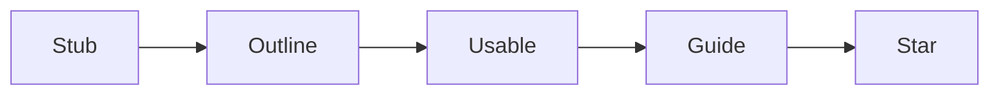

> ⚠️ **Prerequisites:** This skill assumes familiarity with the MediaWiki Action
> API (see **wikimedia-api-access**), parsing wikitext with **mwparserfromhell**
> (**wikimedia-wikitext**), and querying Wikidata (**wikidata**). For batch
> operations, also see **pywikibot**. Language detection and cross-wiki domains
> are covered in **wikimedia-i18n-l10n-for-tools**.

---

## Overview

Wikivoyage (`*.wikivoyage.org`) is a Wikimedia Foundation sister project — a
**free, global travel guide** built collaboratively by travellers. It runs on
MediaWiki but has a fundamentally different content model from Wikipedia.

| Dimension | Wikipedia | Wikivoyage |
|-----------|-----------|------------|
| **Content** | Encyclopedic articles | Destination guides for travellers |
| **Core data** | Free-form prose | **Structured listings** (POIs with name, address, coords, phone, hours, price) |
| **Geography** | Category trees | **Strict hierarchy**: Continent → Country → Region → City → District |
| **Navigation** | Infobox + navboxes | **Breadcrumbs** via `{{IsPartOf}}` + GeoCrumbs extension |
| **Maps** | Optional | **Required** dynamic OSM maps with `{{Mapframe}}` + `{{Marker}}` |
| **Quality** | FA/GA/B/C/Start/Stub | **Travel-readiness**: Stub → Outline → **Usable** → **Guide** → **Star** |
| **Images** | Rich galleries | **Minimal** — constrained by [Image Policy](#image-policy) for mobile travellers |
| **Visual header** | None | **Pagebanner** at top of every article |

### Quick Reference by Task

| Goal | Best Method | Key Details |
|------|-----------|------------|
| Read an article | Action API `parse` or REST API `/page/{title}/html` | Standard MediaWiki APIs |
| Extract listings | Parse wikitext with `mwparserfromhell` or use baturin CSV export | [See listing parsing](#sop-extract-listings-from-wikitext) |
| Find pages with listings | SQL `templatelinks` table or CirrusSearch `hastemplate:` | `hastemplate:"Template:Listing"` |
| Get coordinates for a place | `Module:Marker` auto-fetches from Wikidata P625, or use Nominatim | [See Wikidata integration](#wikidata-integration) |
| Add/edit a listing | Edit page wikitext via Action API (CSRF token) or use the Listing Editor gadget | [See editing listings](#programmatic-editing-of-listings) |
| Check article status | Look for status templates at bottom: `{{Usablecity}}`, `{{Guidecountry}}`, etc. | [See article status](#article-status-system) |
| Get article status via SQL | Query `page_props` for status badge like `wikibase-badge-Q17437796` | Badges in interwiki links |
| Batch export listings | Download pre-built CSV from baturin/wikivoyage-listings | CSV, GPX, KML, OBF, SQL for 8 languages |
| Find articles needing work | CirrusSearch: `hastemplate:"Template:Stub"` or `hastemplate:"Template:Outlinecity"` | [See status](#article-status-system) |

---

## Geographical Hierarchy

Every destination article on Wikivoyage lives in a strict tree:

```
Continent
└── Country
    └── Region (state, province, county)
        ├── City (small / big / huge)
        │   └── District (subpage of huge city)
        ├── Rural area
        ├── Park
        ├── Airport
        └── Station
```

### The `{{IsPartOf}}` Template

Every article declares its **single parent** at the very bottom:

```wikitext
{{IsPartOf|Tokyo (prefecture)}}
```

This drives the **GeoCrumbs** extension which renders breadcrumbs under the
page title: `Asia > Japan > Kanto > Tokyo (prefecture) > Tokyo`

**Rules:**
- List **only the immediate parent** — breadcrumbs chain automatically
- If multiple `{{IsPartOf}}` lines exist, **only the last one** is used
- `{{PartOfTopic}}` for travel topics, `{{PartOfItinerary}}` for itineraries
- Subpages (e.g., `Tokyo/Shibuya`) are automatically recognized as children
- **Cache issue**: Changing a parent's `IsPartOf` requires purging all descendant pages

```python
def get_breadcrumb(title: str, site: str = "en") -> list[str]:
    """Follow IsPartOf chain up to the root to get breadcrumbs."""
    import requests
    API = f"https://{site}.wikivoyage.org/w/api.php"
    crumbs = []
    seen = set()
    current = title

    while current and current not in seen:
        seen.add(current)
        crumbs.append(current)
        resp = requests.get(API, params={
            "action": "parse",
            "page": current,
            "prop": "wikitext",
            "format": "json",
        }, headers={"User-Agent": "WvTool/1.0 (https://example.com; user@example.com)"})
        data = resp.json()
        wikitext = data.get("parse", {}).get("wikitext", {}).get("*", "")

        # Look for {{IsPartOf|ParentName}} or {{IsPartOf|{{subst:PAGENAME}}}}
        import re
        match = re.search(r'\{\{IsPartOf\|([^}]+)\}\}', wikitext)
        if match:
            current = match.group(1).strip()
        else:
            match = re.search(r'\{\{PartOfTopic\|([^}]+)\}\}', wikitext)
            current = match.group(1).strip() if match else None

    return list(reversed(crumbs))
```

### The `{{Geo}}` Template

The article's geographic center is set with `{{geo}}` at the bottom:

```wikitext
{{geo|35.689506|139.6917|zoom=10}}
```

This defines the article's location on maps and generates microformat hCard geo
metadata. The `zoom` parameter controls the default map zoom level (0=Earth,
18=city block).

---

## Article Types & Skeletons

Wikivoyage has **10+ article skeleton types**, each with a predefined section
structure. New articles are created by substituting the boilerplate:

```wikitext
{{subst:smallcity skeleton}}   → Small city template + categories
{{subst:country skeleton}}     → Country template
{{subst:region skeleton}}      → Region template
{{subst:bigcity skeleton}}     → Big city template
{{subst:hugecity skeleton}}    → Huge city (districts)
{{subst:district skeleton}}    → District within a huge city
{{subst:park skeleton}}        → National park / large natural area
{{subst:airport skeleton}}     → Major airport
{{subst:station skeleton}}     → Major train/bus station
{{subst:ruralarea skeleton}}   → Rural area
{{subst:Itinerary skeleton}}   → Itinerary (day-by-day route)
{{subst:Phrasebook skeleton}}  → Language phrasebook
{{subst:Topic article template}} → Travel topic (not a destination)
{{subst:event skeleton}}       → Event
{{subst:divesite skeleton}}    → Dive site
```

### Article Type Quick Reference

| Type | Has Listings? | Has Districts? | Has Map? | Example |
|------|:---:|:---:|:---:|---------|
| Continent | ❌ | ❌ | ❌ | Europe |
| Country | ❌ | ❌ | ❌ | Japan |
| Region | ❌ | ❌ | ❌ | Kanto |
| Small city | ✅ | ❌ | ✅ | Hakone |
| Big city | ✅ | ❌ | ✅ | Kyoto |
| Huge city | ✅ | ✅ (subpages) | ✅ (per district) | Tokyo |
| District | ✅ | ❌ | ✅ | Tokyo/Shibuya |
| Park | ✅ | ❌ | ✅ | Yellowstone |
| Rural area | ✅ | ❌ | ✅ | Cotswolds |
| Airport | ✅ | ❌ | ✅ | Heathrow |
| Station | ✅ | ❌ | ✅ | St. Pancras |
| Travel topic | ❌ (prose only) | ❌ | ❌ | Winter sports in Europe |
| Itinerary | ❌ (day-by-day) | ❌ | ❌ | Tokyo → Kyoto by train |
| Phrasebook | ❌ | ❌ | ❌ | Japanese phrasebook |

---

## Page Structure Anatomy

A standard destination article follows this structure (using Tokyo's raw
wikitext as a real example):

```wikitext
{{pagebanner|Tokyo night banner.JPG|caption=Rainbow Bridge}}
'''Tokyo''' (東京 ''Tōkyō'') is the enormous and wealthy capital of [[Japan]]...

==Districts==
{{Mapframe|35.66322|139.75078|width=550|height=600|zoom=12|group=map1}}
{{Mapshape|type=geoshape|wikidata=Q214051|fill=#cc66cc|group=map1|title=...}}
{{Regionlist
| region1name=Tokyo/Chiyoda| region1color=#cc66cc
| region1description=The seat of Japanese power...
}}

==Understand==
(background, history, culture, climate, orientation)

==Get in==
(how to arrive by plane, train, bus, car, boat)

==Get around==
(local transportation)

==See==
{{see
| name=Meiji Shrine
| alt=Meiji Jingu
| url=https://www.meijijingu.or.jp/
| address=1-1 Yoyogi-Kamizonocho, Shibuya-ku
| lat=35.6763976 | long=139.6993252
| phone=+81 3379-5511
| hours=Dawn to dusk | price=Free
| wikidata=Q378191
| lastedit=2024-03-15
| content=Tokyo's most famous Shinto shrine...
}}

==Do==
==Buy==
==Eat==
==Drink==
==Sleep==

==Go next==
{{routebox
| image1=Joetsu Shinkansen icon.png
| directionl1=N | majorl1=Niigata | minorl1=Ōmiya
| directionr1=S | majorr1=END | minorr1=
}}

{{guidecity}}
{{IsPartOf|Tokyo (prefecture)}}
{{geo|35.689506|139.6917|zoom=10}}
```

### Required Sections Per Article Type

| Section | Country | Region | Small City | Big City | Park |
|---------|:-------:|:------:|:----------:|:--------:|:---:|
| Lead | ✅ | ✅ | ✅ | ✅ | ✅ |
| Districts/Regions | ✅ | ✅ | ❌ | ❌ | ❌ |
| Understand | ✅ | ✅ | ✅ | ✅ | ✅ |
| Get in | ✅ | ✅ | ✅ | ✅ | ✅ |
| Get around | ❌ | ❌ | ✅ | ✅ | ✅ |
| See | ❌ | ❌ | ✅ | ✅ | ✅ |
| Do | ❌ | ❌ | ✅ | ✅ | ❌ |
| Buy | ❌ | ❌ | ✅ | ✅ | ❌ |
| Eat | ❌ | ❌ | ✅ | ✅ | ❌ |
| Drink | ❌ | ❌ | ✅ | ✅ | ❌ |
| Sleep | ❌ | ❌ | ✅ | ✅ | ❌ |
| Stay safe | ❌ | ❌ | ✅ | ✅ | ✅ |
| Go next | ✅ | ✅ | ✅ | ✅ | ✅ |

### The `{{Pagebanner}}` Template

Every article must have a banner image at the top:

```wikitext
{{pagebanner|Tokyo night banner.JPG|caption=Rainbow Bridge}}
```

**Banner specs:**
- Aspect ratio: **7:1** (width:height)
- Minimum dimensions: **2100 × 300 px**
- Format: **JPEG** only
- Destination of the Month banners are uploaded **locally** (not Commons) for better control

### The `{{Quickbar}}` Template (Country Articles)

Country-level articles include a quick-facts sidebar:

```wikitext
{{quickbar
| capital=Andorra la Vella
| currency=Euro (€)
| population=77,543 (2018)
| electricity=220-230 V / 50 Hz (European plug)
| countrycode=+376
}}
```

---

## The Listing System

The **listing system** is the heart of Wikivoyage's data model. Every point
of interest (POI) — attraction, restaurant, hotel, shop — is a structured
listing template.

### Listing Type Wrappers

Each section uses a wrapper template that delegates to `Template:Listing`:

| Section | Template | Type Parameter | Map Color |
|---------|----------|:-------------:|:---------:|
| See | `{{see}}` | `type=see` | Blue (#6ca4ca) |
| Do | `{{do}}` | `type=do` | Green (#83b76b) |
| Buy | `{{buy}}` | `type=buy` | Purple (#817cc0) |
| Eat | `{{eat}}` | `type=eat` | Orange (#e8ba37) |
| Drink | `{{drink}}` | `type=drink` | Maroon (#c38888) |
| Sleep | `{{sleep}}` | `type=sleep` | Red (#cc66cc) |
| (Generic) | `{{listing}}` | `type=listing` | Grey |

### All Listing Parameters

```wikitext
{{see
| name      = Meiji Shrine              <!-- Name (recommended) -->
| alt       = Meiji Jingu               <!-- Alternative/local name -->
| url       = https://...               <!-- Official website (recommended) -->
| email     = info@example.com          <!-- Email -->
| address   = 1-1 Yoyogi-Kamizonocho    <!-- Street address (do not include city) -->
| lat       = 35.6763976                <!-- Latitude (recommended) -->
| long      = 139.6993252               <!-- Longitude (recommended) -->
| directions= 5 min walk from Harajuku  <!-- Brief directions -->
| phone     = +81 3 3379-5511           <!-- Phone number (recommended) -->
| tollfree  = 800-123-456               <!-- Toll-free number -->
| fax       = +81 3 3379-5512           <!-- Fax number -->
| hours     = Dawn to dusk              <!-- Opening hours (recommended) -->
| price     = Free                      <!-- Price info (recommended) -->
| checkin   = 15:00                     <!-- Sleep listing only -->
| checkout  = 11:00                     <!-- Sleep listing only -->
| image     = MeijiShrine.jpg           <!-- Commons filename for map popup -->
| wikipedia = Meiji Shrine              <!-- Wikipedia article title -->
| wikidata  = Q378191                    <!-- Wikidata QID (recommended) -->
| lastedit  = 2024-03-15                <!-- Last verified date (yyyy-mm-dd) -->
| content   = Tokyo's most famous...    <!-- Free-form description -->
}}
```

**Key rules:**
- `lat`/`long`: Decimal format, matching trailing zeros (4 decimal places ≈ 11m accuracy, 5 decimals ≈ 1.1m). Use `NA` to disable Wikidata auto-fetch.
- `address`: Do NOT include city/state/postal code (except UK, Ireland, Germany).
- `phone`: Single number only, with country code. Use comma for multiple.
- `lastedit`: Only update from **in-person verification**, not secondary sources.
- `wikidata`: If set and coordinates are missing, `Module:Marker` auto-fetches from Wikidata P625.

### SOP: Extract Listings from Wikitext

```python
import mwparserfromhell
from typing import Optional

# The core listing template that all type-specific wrappers delegate to
LISTING_TEMPLATES = {"see", "do", "buy", "eat", "drink", "sleep", "listing"}

def extract_listings(wikitext: str) -> list[dict[str, str]]:
    """Extract all listing templates from a Wikivoyage article.

    Args:
        wikitext: Raw page content.

    Returns:
        List of dicts with template name and all parameters.
    """
    parsed = mwparserfromhell.parse(wikitext)
    listings = []

    for template in parsed.filter_templates():
        name = str(template.name).strip().lower()
        if name not in LISTING_TEMPLATES:
            continue

        listing = {"_type": name}
        for param in template.params:
            key = str(param.name).strip()
            value = str(param.value).strip()
            listing[key] = value

        listings.append(listing)

    return listings


def extract_listings_by_section(wikitext: str) -> dict[str, list[dict]]:
    """Extract listings grouped by section heading.

    Returns:
        {"See": [listing, ...], "Eat": [listing, ...], ...}
    """
    import mwparserfromhell
    parsed = mwparserfromhell.parse(wikitext)
    sections = parsed.get_sections(flat=True)

    result = {}
    current_section = "__lead__"

    for section in sections:
        headings = section.filter_headings()
        if headings:
            current_section = str(headings[0].title).strip()

        section_listings = extract_listings(str(section))
        if section_listings:
            result.setdefault(current_section, []).extend(section_listings)

    return result


def fetch_article_listings(title: str, lang: str = "en") -> list[dict]:
    """Fetch a Wikivoyage article and extract its listings.

    Uses the Action API parse module which returns wikitext.
    """
    import requests
    API = f"https://{lang}.wikivoyage.org/w/api.php"

    resp = requests.get(API, params={
        "action": "parse",
        "page": title,
        "prop": "wikitext",
        "format": "json",
    }, headers={
        "User-Agent": "WvTool/1.0 (https://example.com; user@example.com)"
    })
    resp.raise_for_status()
    data = resp.json()

    wikitext = data.get("parse", {}).get("wikitext", {}).get("*", "")
    if not wikitext:
        return []

    return extract_listings(wikitext)
```

### How Listings Are Rendered

The rendering chain works as follows:

1. `{{see | name=... | lat=... | long=... | wikidata=... }}`
2. → `Template:See` passes args to `{{#invoke:Listing|ListingTemplateAndInvoke}}`
3. → `Module:Listing._Listing()` creates a `Marker` object via `Module:Marker`
4. → `Module:Marker._Marker()`:
   - Fetches missing coordinates from Wikidata P625 if `wikidata=` is set
   - Converts coordinates with `Module:Coordinates.toDec()`
   - Looks up marker color by type via `Module:TypeToColor.convertImpl()`
   - Generates a `<maplink>` GeoJSON Feature via `frame:extensionTag()`
5. → `Module:Listing` renders the hCard vcard HTML with name, address, phone, etc.
6. → The `lastedit` field renders as `(updated Mon YYYY)` via `mw.getContentLanguage():formatDate('M Y', lastedit)`

### Listing Validation & Quality

The community has a **`baturin/wikivoyage-listings`** Java tool that:
- Parses XML dumps of Wikivoyage to extract all listings
- Validates email, latitude/longitude, website URLs, Wikidata IDs
- Exports to CSV, GPX, KML, OBF (OsmAnd), SQL, XML

Pre-built exports are available at: https://github.com/wikivoyage/wikivoyage.github.io

---

## Dynamic Maps

Wikivoyage uses the **Kartographer** extension (MediaWiki) to render interactive
OpenStreetMap-based maps. Maps are dynamic — they auto-update as listings are
added, removed, or edited.

### `{{Mapframe}}` — Embedded Map

```wikitext
{{Mapframe|35.66322|139.75078|width=550|height=600|zoom=12
|group=map1|name=Districts of Central Tokyo|show=go,mask}}
```

**Parameters:**
| Parameter | Description | Default |
|-----------|------------|---------|
| `1` (lat) | Latitude of map center | required |
| `2` (long) | Longitude of map center | required |
| `zoom` | 0 (Earth) to 18 (block) | 14 |
| `width` | Map width in px | 300 |
| `height` | Map height in px | 300 |
| `group` | Marker group filter | (all) |
| `show` | Comma-separated types to show | (all) |
| `staticmap` | Fallback static map image | none |

### `{{Maplink}}` — Map Link Icon

```wikitext
{{maplink|lat=35.676|long=139.699|zoom=15|name=Meiji Shrine}}
```

Creates a clickable map icon that opens a full-screen map. Use `{{Marker}}` for
inline listing numbers.

### `{{Marker}}` — Auto-Numbered POI Marker

```wikitext
{{marker|type=see|name=Meiji Shrine|lat=35.676|long=139.699|wikidata=Q378191}}
```

Renders a numbered circle (❶, ❷, etc.) that appears on the article's map.
Numbers are auto-assigned based on page position. The `type=` determines the
color via `Module:TypeToColor`.

### `{{Mapshape}}` — Region/District Boundaries

```wikitext
{{Mapshape|type=geoshape|wikidata=Q214051|fill=#cc66cc|group=map1|title=Chiyoda}}
{{Mapshapes|Q682894}}  <!-- Tokyo Metro subway lines -->
```

Draws polygons (districts) or lines (transit) by pulling GeoJSON from Wikidata.

### Coordinate Sourcing

Wikivoyage editors source coordinates from:
1. **Wikidata** (auto-fetched via `wikidata=` parameter in listings)
2. **OpenStreetMap Nominatim** — right-click → coordinates
3. **Geobatcher** — batch tool for mass-attaching coords to listings
4. **Google Maps** — right-click on dropped pin (at least 4 decimal places)

### SOP: Query Map Data from Wikidata

```sparql
# Find Wikivoyage articles with coordinates for a region
SELECT ?article ?articleLabel ?coord WHERE {
  SERVICE wikibase:label { bd:serviceParam wikibase:language "en". }
  ?article wdt:P31 wd:Q486972;          # instance of human settlement
           wdt:P625 ?coord;              # coordinate location
           wdt:P4342 ?wvPage.            # has Wikivoyage page
  FILTER(CONTAINS(STR(?wvPage), "en.wikivoyage"))
}
```

---

## Image Policy

**This is formal policy**, documented at
[Wikivoyage:Image policy](https://en.wikivoyage.org/wiki/Wikivoyage:Image_policy).

> **Nutshell:** *"Image use in articles should be kept at the minimum necessary
> to get across a point or impression."*

### Rationale

> *"Don't get overexcited adding images to articles. **Travellers may be using
> Wikivoyage from networks with low bandwidth, or with a cost for every MB used.
> Several travellers may be sharing the one poor mobile data connection. A
> traveller using the Wi-Fi on a bus or train may only have a few MB of free
> data allowance for a long journey.**"*

### Concrete Limits

| Article Size | Max Images |
|---|---|
| < 3,000 bytes | 1–2 (including map) |
| Longer articles | ~1 per screen (~1,000–2,000 bytes of text) |

### Rules Summary

- ✅ Right-alignment preferred. Test layout at 640px minimum width.
- ❌ **No more than 2–3 consecutive images** without text space between them.
- ❌ **No left-alignment** just to squeeze more images in.
- ❌ **No video or audio clips** — except pronunciation files in phrasebooks and
     place name audio in Understand sections.
- ❌ **No people in photos** (discouraged by policy — personality rights concerns).
- ❌ **No images extending below the bottom of the article** at typical widths.
- ✅ Images in listing `|image=` parameters are fine — they only show on map
     popups, not inline. This does not count against the limit.
- ✅ Banner images (`{{pagebanner}}`) are required and don't count as "images"
     for the purpose of this limit.

### Non-Free Content

Wikivoyage **prohibits fair-use images** unless they are uploaded locally and
meet the project's non-free content criteria. All other images must be on
Wikimedia Commons with a free license (CC BY-SA, CC BY, CC0, Public Domain).

---

## Article Status System

Wikivoyage has a **travel-readiness scale**, different from Wikipedia's
WikiProject assessment. Status is indicated by a template at the bottom of the
article. The status **varies by article type** in the template name.

### The 5-Level Scale



| Level | Icon | Template Pattern | Criteria |
|-------|:----:|-----------------|----------|
| **Stub** | ⬜ | `{{Stub}}` | Barely any content. No article skeleton used. Often short-lived — adding skeleton headers bumps to Outline. |
| **Outline** | 🟢 | `{{Outlinecity}}`, `{{Outlinecountry}}`, etc. | Has skeleton + introduction but sections are mostly empty. Not yet useful for a traveller. |
| **Usable** | 🟡 | `{{Usablecity}}`, `{{Usablecountry}}`, etc. | **Minimum useful guide.** A traveller could get there, eat, and sleep with this info alone. Has at least one prominent attraction. |
| **Guide** | 🔵 | `{{Guidecity}}`, `{{Guidecountry}}`, etc. | **Complete for the average traveller.** Offers alternatives for eat/sleep/see. Enough for several days. Follows MoS in spirit. |
| **Star** | ⭐ | `{{Starcity}}`, `{{Starcountry}}`, etc. | **Essentially complete.** Follows MoS exactly. Has illustrations, maps, tight effective prose. Changes only needed when the destination changes. |

### Status Template Names by Article Type

| Base Type | Stub | Outline | Usable | Guide | Star |
|-----------|------|---------|--------|-------|------|
| City/District | — | `Outlinecity` | `Usablecity` | `Guidecity` | `Starcity` |
| Region | — | `Outlineregion` | `Usableregion` | `Guideregion` | `Starregion` |
| Country | — | `Outlinecountry` | `Usablecountry` | `Guidecountry` | `Starcountry` |
| Park | — | `Outlinepark` | `Usablepark` | `Guidepark` | `Starpark` |
| Travel topic | — | `Outlinetopic` | `Usabletopic` | `Guidetopic` | `Startopic` |
| Itinerary | — | `Outlineitinerary` | `Usableitinerary` | `Guideitinerary` | `Staritinerary` |
| Phrasebook | — | `Outlinephrasebook` | `Usablephrasebook` | `Guidephrasebook` | `Starphrasebook` |

### Querying Article Status Programmatically

**Via SQL (templatelinks table):**
```sql
-- Find all guide-level city articles on en.wikivoyage
SELECT tl_from, page_title
FROM templatelinks
JOIN page ON tl_from = page_id
WHERE tl_namespace = 10  -- Template namespace
  AND tl_title = 'Guidecity'
  AND page_namespace = 0;  -- Main namespace
```

**Via Action API (parse wikitext):**
```python
def get_article_status(title: str, lang: str = "en") -> str | None:
    """Fetch a Wikivoyage article's status by looking for status templates."""
    import requests, re
    API = f"https://{lang}.wikivoyage.org/w/api.php"
    resp = requests.get(API, params={
        "action": "parse", "page": title,
        "prop": "wikitext", "format": "json",
    }, headers={"User-Agent": "WvTool/1.0"})
    wikitext = resp.json().get("parse", {}).get("wikitext", {}).get("*", "")

    # Match any status template (Usablecity, Guidecountry, Starcity, etc.)
    status_pattern = r'\{\{(Stub|Outline|Usable|Guide|Star)(city|region|country|park|topic|itinerary|phrasebook)\}\}'
    match = re.search(status_pattern, wikitext)
    if match:
        return f"{match.group(1)} ({match.group(2)})"
    return None
```

**Via Wikidata badges (interwiki links):**
```sparql
# Find star-article destinations
SELECT ?item ?itemLabel ?wvPage WHERE {
  ?item wdt:P4342 ?wvPage.
  FILTER(CONTAINS(STR(?wvPage), "en.wikivoyage"))
  ?wvLink schema:about ?item;
           schema:isPartOf <https://en.wikivoyage.org/>;
           wikibase:badge wd:Q17437796.  # featured article badge
  SERVICE wikibase:label { bd:serviceParam wikibase:language "en". }
}
```

### Wikidata Badge Mapping

| Badge | QID | Meaning |
|-------|:---:|---------|
| Featured article | Q17437796 | Star article |
| Good article | Q17437798 | Guide article |
| Recommended article | Q17559452 | Usable or Guide article |

---

## Wikidata Integration

Wikivoyage and Wikidata are closely integrated. Key integration points:

### Coordinate Auto-Fetch

When a listing has `wikidata=Q378191` but no `lat`/`long`, `Module:Marker`
automatically queries Wikidata property **P625** (coordinate location):

```lua
-- From Module:Marker
local coords = mw.wikibase.getBestStatements(wikidata_id, 'P625')
if coords[1] and coords[1].mainsnak.datavalue then
    lat = coords[1].mainsnak.datavalue.value.latitude
    long = coords[1].mainsnak.datavalue.value.longitude
end
```

### Image Auto-Fetch

Same pattern for `|image=` — if omitted but `wikidata=` is set, `Module:Marker`
fetches property **P18** (image):

```lua
if not has_image then
    local immagine = mw.wikibase.getBestStatements(wikidata_id, 'P18')
    args.image = immagine[1] and immagine[1].mainsnak.datavalue.value
end
```

### Map Shapes from Wikidata

`{{Mapshape}}` pulls GeoJSON geometry directly from Wikidata properties:

```wikitext
{{Mapshape|type=geoshape|wikidata=Q214051|fill=#cc66cc|title=Chiyoda}}
```

This renders administrative boundaries, subway lines, etc. using Wikidata
geoshape/geoline data.

### Listing Properties ↔ Wikidata Mapping

| Listing Parameter | Wikidata Property | Notes |
|-------------------|:----------------:|-------|
| `name` | Item label | — |
| `alt` | P1705 (native label) | Alternative/local name |
| `address` | P969 (street address) | City NOT included |
| `directions` | P2795 (directions) | Brief directions |
| `lat`/`long` | P625 (coordinate location) | Auto-fetched if missing |
| `phone` | P1329 (phone number) | Toll-free: same + P1552 Q348308 |
| `email` | P968 (email address) | — |
| `fax` | P2900 (fax number) | — |
| `url` | P856 (official website) | Include https:// |
| `hours` | P3025–P3028 | Opening days/period |
| `image` | P18 (image) | Auto-fetched if missing |
| `wikidata` | — | The item itself |

### Finding Wikidata Items for Listings

Use the **wikidata-vector-search** skill to find QIDs for POIs by description:

```python
# Example: find a QID for "The Shard observation deck London"
# Use vector search to find it by meaning
```

For batch mapping of Wikivoyage listings to Wikidata, see the
[Wikidata:Wikivoyage/Resources](https://www.wikidata.org/wiki/Wikidata:Wikivoyage/Resources)
page for detailed property mapping.

---

## Programmatic Access

### Reading Articles

**Action API — parse module** (returns wikitext or HTML):

```python
import requests
API = "https://en.wikivoyage.org/w/api.php"
resp = requests.get(API, params={
    "action": "parse",
    "page": "Tokyo",
    "prop": "wikitext|text|images|links|categories",
    "format": "json",
}, headers={"User-Agent": "WvTool/1.0 (https://example.com; user@example.com)"})
```

**REST API** (read-only, HTML output):

```
GET https://en.wikivoyage.org/api/rest_v1/page/html/Tokyo
GET https://en.wikivoyage.org/api/rest_v1/page/summary/Tokyo
GET https://en.wikivoyage.org/api/rest_v1/page/related/Tokyo
```

### Searching Articles

**CirrusSearch** (Action API):

```python
resp = requests.get(API, params={
    "action": "query",
    "list": "search",
    "srsearch": "hastemplate:\"Template:Listing\" insource:tokyo",
    "srlimit": 50,
    "format": "json",
})
```

Useful Wikivoyage search patterns:
- `hastemplate:"Template:Listing"` — all pages with listings
- `hastemplate:"Template:Usablecity"` — usable city-guide articles
- `hastemplate:"Template:Outlinecountry"` — country articles needing work
- `insource:"lastedit=20"` — listings last verified in the 2020s (potentially stale)

### Reading from the XML Dump

The full XML dump of English Wikivoyage is ~100 MB (compressed), available at:
`https://dumps.wikimedia.org/enwikivoyage/latest/`

```python
import bz2, xml.etree.ElementTree as ET
from typing import Iterator

def iter_dump_pages(dump_path: str) -> Iterator[tuple[str, str]]:
    """Iterate over pages in a Wikivoyage XML dump.

    Yields:
        (title, wikitext) tuples
    """
    with bz2.open(dump_path, "rt", encoding="utf-8") as f:
        # Skip to <page> elements
        for event, elem in ET.iterparse(f, events=("end",)):
            if elem.tag.endswith("page"):
                title = elem.find(".//{*}title").text
                text = elem.find(".//{*}text").text or ""
                yield (title, text)
                elem.clear()
```

### Using Pre-Built Community Exports

The **baturin/wikivoyage-listings** project provides ready-to-download data:
- CSV (all 8 languages) — plain tabular
- GPX — GPS waypoints
- KML — Google Earth
- OBF — OsmAnd offline maps
- SQL — importable database with `listings` + `listings_binary` tables

Download: `https://github.com/wikivoyage/wikivoyage.github.io`

### Programmatic Editing of Listings

Editing Wikivoyage requires **authentication** (see **wikimedia-auth-oauth**)
and follows the standard MediaWiki `action=edit` pattern. Listings are edited
by replacing the wikitext of the page.

```python
import requests

def add_listing(title: str, section: str, listing_wikitext: str,
                lang: str = "en", token: str = None, session: requests.Session = None):
    """Add a listing to a Wikivoyage article section.

    Args:
        title: Article title (e.g., 'Tokyo')
        section: Section name (e.g., 'See', 'Eat')
        listing_wikitext: The full {{see|...}} template wikitext
        token: CSRF token (obtained via action=query&meta=tokens)
        session: Authenticated requests.Session with OAuth or bot password
    """
    API = f"https://{lang}.wikivoyage.org/w/api.php"

    # 1. Fetch current content
    resp = session.get(API, params={
        "action": "parse",
        "page": title,
        "prop": "wikitext",
        "format": "json",
    })
    wikitext = resp.json()["parse"]["wikitext"]["*"]

    # 2. Find section and append listing
    import re
    section_pattern = rf"(==+\s*{re.escape(section)}\s*==+\n)"
    match = re.search(section_pattern, wikitext)
    if not match:
        raise ValueError(f"Section '{section}' not found in {title}")

    # Insert listing after the section heading, before the next heading
    insert_pos = match.end()
    # Find next heading or end
    next_heading = re.search(r'\n==+[^=]', wikitext[insert_pos:])
    if next_heading:
        insert_pos += next_heading.start()
    else:
        insert_pos = len(wikitext)

    new_wikitext = wikitext[:insert_pos] + "\n" + listing_wikitext + "\n" + wikitext[insert_pos:]

    # 3. Save
    resp = session.post(API, data={
        "action": "edit",
        "title": title,
        "text": new_wikitext,
        "token": token,
        "summary": f"Added {section} listing",
        "format": "json",
    })
    return resp.json()
```

---

## Script Policy & Bots

Wikivoyage has a **strict script policy**:

> *"Automated scripts that modify travel guide pages and images on the wiki
> must comply with the script policy and be approved."*

**Key rules:**
1. **Approval required** — Bots/scripts need approval at
   [Wikivoyage:Script nominations](https://en.wikivoyage.org/wiki/Wikivoyage:Script_nominations)
2. **Rate limiting** — No more than one request every 30 seconds
3. **No automatic `lastedit` updates** — Only human-verified information
4. **Transparent operation** — Scripts must identify themselves via User-Agent
   and bot flag
5. **No mass deletion** — Individual review required for listing removal

**Approved use cases** (typically granted):
- Dead link detection
- Coordinates bulk-filling from Wikidata
- Template standardization
- Cross-language listing sync
- Statistical analysis and reporting

---

## Special Article Types

### Travel Topics (`{{Outlinetopic}}`, `{{Guidetopic}}`, etc.)

Non-destination articles about travel subjects (e.g., "Winter sports in Europe",
"Tipping in Japan"). They:
- Have **no listing templates** (prose only)
- Link to destination articles for specific listings
- Use `{{PartOfTopic}}` instead of `{{IsPartOf}}`
- Follow a different skeleton: Introduction → Understand → Prepare → Stay safe → Go next

### Itineraries (`{{Itinerary skeleton}}`)

Day-by-day travel routes (e.g., "Tokyo → Kyoto by train"). They:
- Use `{{PartOfItinerary}}` for breadcrumbs
- Are structured by day/stop rather than by listing type
- Can reference but do not duplicate destination listings

### Phrasebooks (`{{Phrasebook skeleton}}`)

Language guides (e.g., "Japanese phrasebook"). They:
- Use `{{PartOfTopic}}` for breadcrumbs
- Contain pronunciation audio files (one of the two allowed audio use cases)
- Have a special section structure: Pronunciation → Phrase list (by topic)

### Airports & Stations

For major transport hubs (e.g., Heathrow, St. Pancras). They:
- Have `{{IsPartOf}}` pointing to their host city
- Include listings for services (lounges, shops, restaurants)
- Have sections for ground transportation connections

### Dive Sites

For underwater destinations. They have unique sections:
- Dive conditions (visibility, depth, current)
- Marine life
- Hazards
- Equipment

---

## Guardrails

### ❌ Don't Assume Wikipedia Equivalents
Wikivoyage is not Wikipedia. It has a different content model, different
policies, different quality standards, and a different community. Do not apply
Wikipedia patterns uncritically.

### ❌ Don't Add Many Images
Follow the [Image Policy](#image-policy). Minimal images are intentional —
travellers on mobile data are the primary audience. A single representative
photo per article is often enough. Additional images belong in listing
`|image=` parameters (map popup only).

### ❌ Don't Use Video or Audio
Audio/video is almost never permitted. The only exceptions are pronunciation
audio files in phrasebooks and place name audio in Understand sections.

### ❌ Don't Update `lastedit` Without Verification
The `lastedit` field should only be set to the current date after **in-person
verification**. Do not bump it because you edited the page, or because the
listing came from a website.

### ❌ Don't Run Automated Edits Without Approval
All scripts that modify pages require approval at
[Script nominations](https://en.wikivoyage.org/wiki/Wikivoyage:Script_nominations).
Running unapproved bots may result in a block.

### ❌ Don't Ignore the Geographical Hierarchy
Every destination article must have exactly one `{{IsPartOf}}`. A hotel
article is not valid — hotels are listings within city articles. A street
article is not valid — content belongs in the city or district.

### ❌ Don't Assume Coordinates Are in the Article
Many listings lack coordinates. `lat=NA & long=NA` disables Wikidata auto-fetch
for items that shouldn't have coordinates (e.g., online-only services).

### ❌ Don't Change Coordinates Without Checking Wikidata
If a listing has `wikidata=` but no `lat/long`, `Module:Marker` fetches them
automatically. Adding explicit coordinates that contradict Wikidata will cause
confusion — set `lat=NA|long=NA` if you want to suppress Wikidata entirely.

### ❌ Don't Copy Wikipedia Content
Wikivoyage has a distinct voice — it's a travel guide, not an encyclopedia.
Copying from Wikipedia will produce content that is too dry, too detailed, and
not useful for travellers. Rewrite for the travel context.

---

## Cross-References

| Related Skill | Why |
|--------------|-----|
| **[wikimedia-api-access](../wikimedia-api-access/SKILL.md)** | Foundation — all Wikivoyage API calls use these patterns |
| **[wikimedia-wikitext](../wikimedia-wikitext/SKILL.md)** | Parsing listing templates with `mwparserfromhell` |
| **[wikidata](../wikidata/SKILL.md)** | Querying QIDs for listings, property lookups, SPARQL for batch geocoding |
| **[wikidata-vector-search](../wikidata-vector-search/SKILL.md)** | Finding QIDs for POIs by natural language description |
| **[wikimedia-search-cirrussearch](../wikimedia-search-cirrussearch/SKILL.md)** | Searching Wikivoyage articles with `hastemplate:`, `insource:`, `haswbstatement:` |
| **[wikimedia-commons](../wikimedia-commons/SKILL.md)** | Finding and referencing banner images, listing photos |
| **[wikimedia-commons-thumbnails](../wikimedia-commons-thumbnails/SKILL.md)** | Thumbnail URLs for banners and listing images |
| **[wikimedia-database](../wikimedia-database/SKILL.md)** | SQL queries against `enwikivoyage_p` replicas |
| **[wikimedia-pageviews](../wikimedia-pageviews/SKILL.md)** | Pageview analysis for travel destinations |
| **[wikimedia-auth-oauth](../wikimedia-auth-oauth/SKILL.md)** | Authentication for editing Wikivoyage programmatically |
| **[pywikibot](../pywikibot/SKILL.md)** | Batch listing operations, dump processing, status analysis |
| **[wikimedia-toolforge](../wikimedia-toolforge/SKILL.md)** | Hosting tools (listing editors, geocoding helpers, status checkers) |
| **[mediawiki-page-navigation](../mediawiki-page-navigation/SKILL.md)** | General navigation patterns; Wikivoyage extends this with GeoCrumbs/IsPartOf |
| **[wikimedia-i18n-l10n-for-tools](../wikimedia-i18n-l10n-for-tools/SKILL.md)** | Multilingual tooling — Wikivoyage has 25+ language editions |
| **[wikipedia-error-handling](../wikipedia-error-handling/SKILL.md)** | Same error/rate-limit handling patterns apply |
| **[wikipedia-templates](../wikipedia-templates/SKILL.md)** | General template concepts; Wikivoyage has its own template ecosystem |
| **[wikipedia-categories](../wikipedia-categories/SKILL.md)** | Wikivoyage categories exist but are secondary to the geographical hierarchy |
| **[mediawiki-translate-extension](../mediawiki-translate-extension/SKILL.md)** | Translating travel guides between language editions |

---

## Tooling

### 🔧 Scripts

*No scripts shipped yet — this is a starting point for the community to build.*

Planned script categories:
- `scripts/extract-listings.sh` — Extract all listings from a page into JSON
- `scripts/article-status.sh` — Check article status and suggest improvements
- `scripts/find-stale-listings.sh` — Find listings with old `lastedit` dates
- `scripts/check-coverage.sh` — Identify missing listing sections per article

### 🐍 Python Assets

*No assets shipped yet.*

Planned:
- `assets/listing_parser.py` — Importable module: extract/validate/transform listings
- `assets/status_checker.py` — Importable module: article status analysis
- `assets/coverage_scanner.py` — Importable module: section completeness checks

### 📚 Reference Docs

*No reference docs shipped yet.*

Planned:
- `references/listing-parameters.md` — Full parameter reference for all listing types
- `references/article-skeletons.md` — Section maps for all 10+ skeleton types
- `references/wikidata-mapping.md` — Complete Wikidata property mapping for listings
