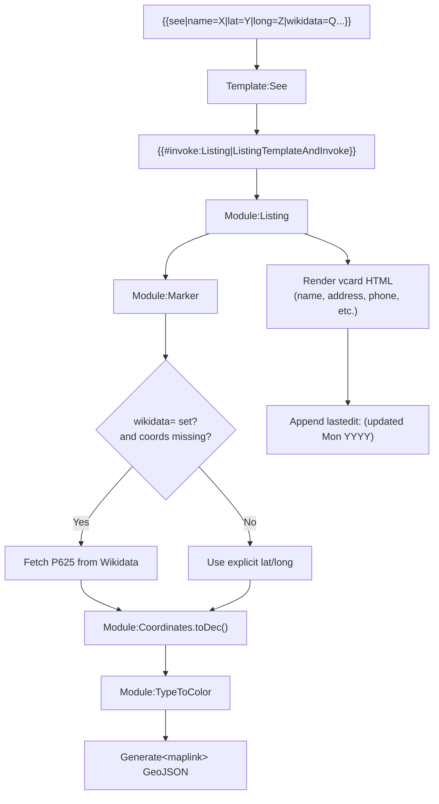

# Wikivoyage Listing Parameters — Quick Reference

## Type-Specific Wrappers

| Template | Section | Type Value | Map Color | Color Hex |
|----------|---------|:----------:|-----------|:----------:|
| `{{see}}` | See (attractions) | `see` | Blue | `#6ca4ca` |
| `{{do}}` | Do (activities) | `do` | Green | `#83b76b` |
| `{{buy}}` | Buy (shopping) | `buy` | Purple | `#817cc0` |
| `{{eat}}` | Eat (restaurants) | `eat` | Orange | `#e8ba37` |
| `{{drink}}` | Drink (bars/cafes) | `drink` | Maroon | `#c38888` |
| `{{sleep}}` | Sleep (hotels) | `sleep` | Red | `#cc66cc` |
| `{{listing}}` | Any / generic | `listing` | Grey | default |

## Full Parameter Reference

| Parameter | Type | Usage | Required? |
|-----------|------|-------|:---------:|
| `name` | String | Trade name / dba of the venue | Recommended |
| `alt` | String | Alternative name (local language, former name, nickname) | Optional |
| `url` | URL | Official website (include `https://`) | Recommended |
| `email` | Email | Contact email address | Optional |
| `address` | String | Street address. Do NOT include city (same as article title) | Recommended (Eat/Drink/Buy/Sleep) |
| `lat` | Float | Latitude in WGS84 decimal, range -90 to 90, 4-5 decimal places | Recommended |
| `long` | Float | Longitude in WGS84 decimal, range -180 to 180, 4-5 decimal places | Recommended |
| `directions` | String | Brief directions (cross streets, transit stops). Uncapitalized, no period | Optional |
| `phone` | String | Phone number with country code (e.g., `+1 234-567-8901`) | Recommended |
| `tollfree` | String | Toll-free number | Optional |
| `fax` | String | Fax number | Optional |
| `hours` | String | Opening hours (see Wikivoyage:Time and date formats) | Recommended |
| `checkin` | String | Check-in time (sleep only) | Optional |
| `checkout` | String | Check-out time (sleep only) | Optional |
| `price` | String | Price range or specific prices | Recommended |
| `image` | String | Commons filename for map popup (e.g., `MeijiShrine.jpg`, no `File:` prefix) | Optional |
| `wikipedia` | String | Wikipedia article title | Optional |
| `wikidata` | QID | Wikidata item identifier (e.g., `Q378191`) | Recommended |
| `lastedit` | Date | Last verified date in `yyyy-mm-dd` format. **Only from in-person verification** | Conditional |
| `content` | String | Free-form prose description | Optional |
| `counter` | Integer | Explicitly assign map marker number | Optional |

## Formatting Rules

### Coordinates
- Same number of decimal places for both lat and long (pad trailing zeros if needed)
- 4 decimal places ≈ 11m accuracy (sufficient for most uses)
- 5 decimal places ≈ 1.1m accuracy (crowded urban areas)
- More than 5 decimal places is excessive
- Use `lat=NA|long=NA` to suppress Wikidata auto-fetch

### Phone Numbers
- Country code required: `+1 234-567-8901`
- Single number preferred
- Multiple numbers separated by comma: `+1 234-567-8901 (front-desk), +1 456-789-0123 (reservations)`

### Addresses
- Do NOT include city (it's the article title)
- Do NOT include state/province or postal code
- **Exceptions:** UK, Ireland, Germany — include postal code
- Japan format: `Meieki 4-5-6` (ward/neighborhood + block + building)

### lastedit
- RFC 3339 format: `2024-03-15`
- Only update from **in-person verification**
- Leave blank for listings sourced from websites or secondary sources
- Auto-populated by Listing Editor gadget when "mark as up-to-date" checked

### Price
- Use currency symbol accepted at the establishment
- Price ranges: `$10-20`, `€5-15`
- Categories for Eat: `Budget`, `Mid-range`, `Splurge`
- Categories for Sleep: `Budget`, `Mid-range`, `Splurge`

## Listing Rendering Chain

## Related Templates

| Template | Purpose |
|----------|---------|
| `{{Marker}}` | Inline numbered marker (❶ ❷ ❸) with map link |
| `{{Mapframe}}` | Embedded dynamic OSM map |
| `{{Maplink}}` | Clickable icon opening full-screen map |
| `{{Mapshape}}` | GeoJSON polygon from Wikidata (districts, boundaries) |
| `{{Mapshapes}}` | GeoJSON lines from Wikidata (transit lines) |
| `{{Listing}}` | Generic backend template (all type-specific wrappers delegate here) |
| `{{Dead link}}` | Marks a URL as non-functional (placed by bot) |
| `{{Flag}}` | Country flag icon (used in embassy listings) |
